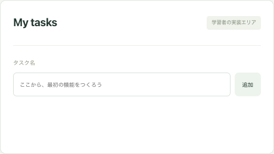
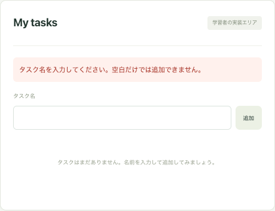
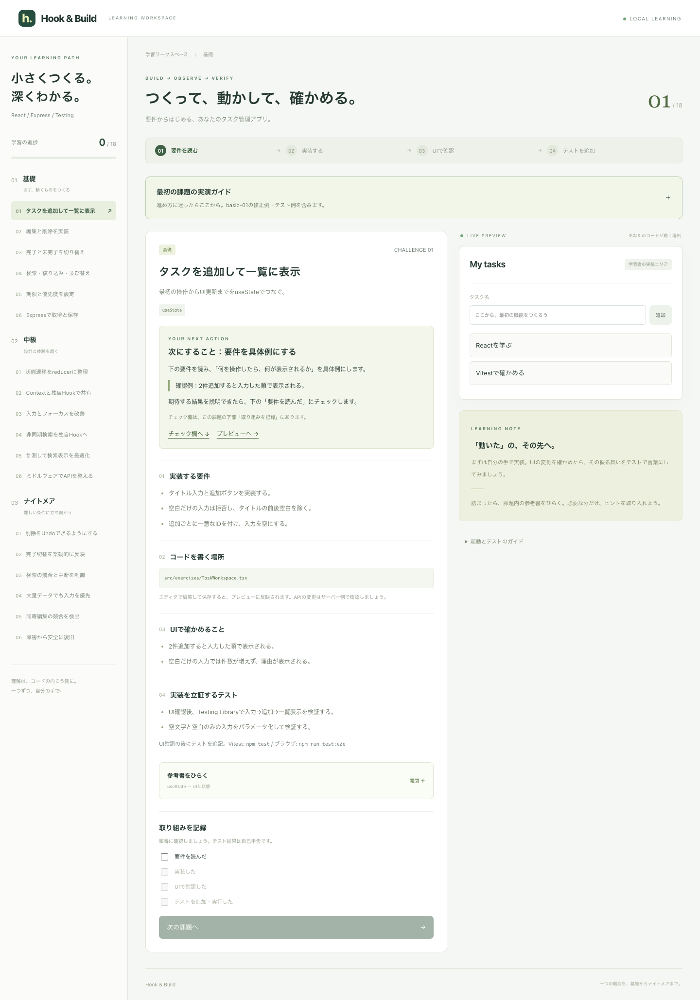

# 実演：タスク追加を、要件からテストまで進める

この記録は、あなたが書いたbasic-01のコードを出発点として、実際に確認・修正・テストを行った履歴です。ゼロから完成解答を置いた例ではありません。

最初に読むなら、アプリ上部の **「最初の課題の実演ガイド」** を開いてください。各課題の「次にすること」は、あなたのチェックに合わせて変わります。

## まず、作業する場所を分ける

| 場所 | ここですること |
| --- | --- |
| アプリの課題欄 | 要件と期待する結果を読む |
| 普段のエディタ | `src/exercises/TaskWorkspace.tsx` を編集・保存する |
| タスク管理プレビュー | 自分の実装を操作する。PCでは右側、狭い画面では課題の下側 |
| エディタのテストファイル | UI確認後に `src/exercises/TaskWorkspace.test.tsx` を追加・編集する |
| ターミナル | アプリを起動し、テストを実行して結果を読む |
| 課題下部のチェック欄 | 自分が確認した工程を記録する。自動採点ではない |

起動していない場合だけ、プロジェクトのターミナルで実行します。

```sh
npm run dev
```

http://127.0.0.1:5173 を開きます。起動用ターミナルはそのままにして、テストは別のターミナルで実行すると分かりやすくなります。

コードを入力するのはエディタです。アプリの「タスク名」は動作確認用の入力欄です。
課題を選択してもソースコードは自動で切り替わりません。同じタスクアプリに機能を積み重ねます。

## 01 要件を読む：操作と期待結果に言い換える

basic-01の要件を、確認可能な例に分けました。

| 要件 | 試す操作 | 期待する結果 |
| --- | --- | --- |
| 空白だけの入力を拒否 | スペース3文字で「追加」 | タスクが増えず、拒否した理由が見える |
| 前後空白を除く | `  Reactを学ぶ  ` を追加 | タイトルが `Reactを学ぶ` になる |
| 追加後に入力を空にする | 通常のタイトルを追加 | 入力欄が空になる |
| 入力順で表示 | 続けて `Vitestで確かめる` を追加 | 2件が追加した順に並ぶ |
| 各タスクに一意なID | 追加処理を読む | 各追加で `crypto.randomUUID()` を呼び、Reactのkeyにも使う |

ここでのポイントは、Hooksの名前からコードを書き始めるのではなく、**何が起きれば要件を満たしたかを先に決めること**です。説明できたら「要件を読んだ」を記録します。

### 出発点でできていたこと

あなたのコードには、入力のstate、タスク配列のstate、追加処理、ID生成、入力クリアがありました。この構造を活かしました。

[変更前のコード全体](basic-01.before.tsx.txt) をそのまま保存しています。

### 実際に見つかった問題

変更前のChromeでスペース3文字を入力して「追加」を押しました。

- 入力欄は空になりました。
- エラーメッセージは出ませんでした。
- 空のタイトルを持つ行が1件増えていました。

通常入力では一覧に表示できても、境界となる入力では要件を満たしていませんでした。



観測値は [before-observations.json](before-observations.json) に保存しています。

## 02 実装する：整形してから検証する

変更前の順序は次のとおりでした。

```tsx
if (!userInputTask) return setErrorMessage('入力がありませんでした。');
const trimText = userInputTask.trim();
```

`'   '` は空文字ではないため、最初の条件では拒否されません。その後trimすると空になるので、検証を通り抜けた空タイトルが追加されます。

順序を入れ替えました。

```tsx
const trimText = userInputTask.trim();
if (!trimText) {
  return setErrorMessage('タスク名を入力してください。空白だけでは追加できません。');
}
const newTask = { id: crypto.randomUUID(), title: trimText };
setTaskList((currentTasks) => [...currentTasks, newTask]);
setUserInputTask('');
setErrorMessage('');
```

変更の理由は以下です。

- 整形済みの値を検証すると、空文字と空白のみを同じ条件で扱える。
- 配列の更新は直前の状態に追加する形にする。
- UUIDの生成は更新関数の外で行い、更新関数自体は新しい配列を返すだけにする。
- エラーには `role="alert"` と入力との関連付けを追加し、利用者にもテストにも意味が伝わるようにする。
- タスク一覧を `ul` / `li` にし、空の状態と一覧を区別する。

[変更後のコード全体](basic-01.after.tsx.txt) も固定の記録として保存しました。今後あなたが編集する実ファイルは `src/exercises/TaskWorkspace.tsx` です。

保存して画面に反映できたら「実装した」を記録します。この時点ではテストをまだ追加していません。

## 03 UIで確認する：要件の例をそのまま操作する

修正後、起動中のアプリをChromeで操作しました。操作は再現用スクリプトで実行し、スクリーンショットを目視確認しました。

| 操作 | 実際の観測 |
| --- | --- |
| スペース3文字を追加 | エラーが1つ表示され、空のタスク行は増えない |
| `  Reactを学ぶ  ` を追加 | `Reactを学ぶ` と表示され、入力が空になり、エラーが消える |
| `Vitestで確かめる` を追加 | 上から `Reactを学ぶ` → `Vitestで確かめる` の順になる |
| 幅390pxで実演ガイドを開く | 横方向のはみ出しがない。縦方向に読み進められる |





[モバイル表示](images/after-mobile.png) / [開いた実演ガイド](images/after-guide.png) / [観測値JSON](after-observations.json)

確認が違っていたらコードに戻ります。期待どおりなら「UIで確認した」を記録して、初めてテスト追加へ進みます。

## 04 テストを追加：手で確かめた操作をコードにする

Vitest + Testing Libraryでは、タスク画面だけを描画して確認します。

```tsx
import { render, screen } from '@testing-library/react';
import userEvent from '@testing-library/user-event';
import { expect, it } from 'vitest';
import TaskWorkspace from './TaskWorkspace';

it('前後空白を除いて追加し、入力を空にする', async () => {
  const user = userEvent.setup();
  render(<TaskWorkspace />); // 準備
  const input = screen.getByRole('textbox', { name: 'タスク名' });
  await user.type(input, '  Reactを学ぶ  '); // 操作
  await user.click(screen.getByRole('button', { name: '追加' }));
  expect(screen.getByRole('listitem').textContent).toBe('Reactを学ぶ');
  expect(input).toHaveValue(''); // 期待結果
});
```

読み方は「準備 → 操作 → 結果の確認」です。

- `render` はテスト内にコンポーネントを表示する。
- `getByRole` は利用者が見つける入力欄やボタンの役割・名前で探す。
- `user.type` / `user.click` は入力・クリックを再現する。
- `expect` は期待する結果と実際の表示を比べる。

今回追加したファイルは `src/exercises/TaskWorkspace.test.tsx`。5件のテストで、2件の追加・空文字・半角空白・全角空白・エラー後の修正を確認しています。

```sh
npm test -- src/exercises/TaskWorkspace.test.tsx
```

`Tests ... passed` をターミナルで確認します。**自分のテストファイル名と、自分が追加したテストが実行されたことも確認**してください。

失敗したら「expected」と「received」や表示されたDOMを見て、要件・実装・テストのどこが違うかを確認します。期待値を実装に合わせて弱める前に、要件に戻ります。

[実際に追加したテストの固定コピー](basic-01.test.tsx.txt) を残しました。将来の課題では実ファイルにテストを追記し、この追加機能のテストも維持します。

### 実ブラウザでも同じことを確かめる

`e2e/exercises/basic-01.spec.ts` には、起動中のアプリで同じ操作を行うPlaywrightテストを追加しました。

```sh
# このPCのGoogle Chromeを使う場合
PLAYWRIGHT_CHANNEL=chrome npm run test:e2e -- e2e/exercises/basic-01.spec.ts

# Playwright用Chromiumがインストール済みなら
npm run test:e2e -- e2e/exercises/basic-01.spec.ts
```

今回の実ブラウザテストはChromiumのダウンロードではなく、インストール済みGoogle Chromeを使いました。

## 結果と、次に自分で進めること

- UI確認の後でテストを追加し、basic-01のコンポーネントテスト5件が成功。
- 既存の学習基盤を含め、Vitest全24件・ブラウザテスト4件が成功。
- React・Express・E2E・設定ファイルの型チェック、ビルド、Lintも成功。
- 独立レビューで、実演のテスト例も前後空白まで完全一致で検証する形に揃えた。
- 検証用ブラウザは独立した一時セッションで、あなたの学習進捗は変更していません。

自分でも内容を確認したら、basic-01の4工程を順にチェックし、basic-02「編集と削除を実装」に進んでください。

次は例えば「編集をキャンセルしたら元のタイトルが残る」という具体例を決め、今のタスク一覧に編集UIを追加し、操作確認した後にキャンセルのテストを追加します。basic-02の完成解答は今回実装していません。

## 記録を再現する

先に `npm run dev` でアプリを起動しておきます（起動済みなら不要）。

```sh
node scripts/capture-walkthrough.mjs after
```

現在の画面をChromeで操作し、画像と観測JSONを更新します。`before` は変更前の採取に使用した引数です。変更前のコードへ戻すコマンドではないため、現在のコードで実行しても過去の動作は再現できません。
