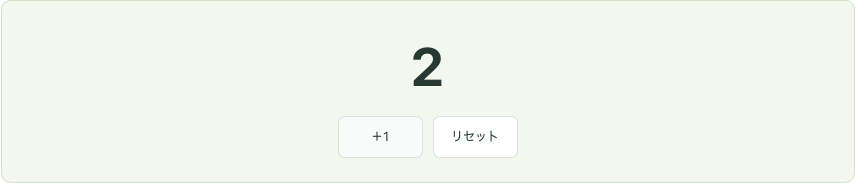

# チャプター0：カウンターの実演記録

入力欄より簡単なカウンターで、要件→実装→UI確認→テスト追加を一巡しました。完成済みの実演なので、コードを読んでから自分でも再現できます。

## 01 要件を決めた

- 初期は0。
- ＋1を押すたびに1増える。
- リセットで0に戻る。

確認する操作は「初期 → ＋1 → ＋1 → リセット」。期待は「0 → 1 → 2 → 0」。

## 02 実装した

`src/tutorial/Counter.tsx` にuseStateを使う小さなコンポーネントを作成。タスク一覧・入力・APIから独立させました。アプリの初期画面とサイドバーに「00 はじめに」を追加しました。

```tsx
const [count, setCount] = useState(0);
// ＋1のクリック
setCount((current) => current + 1);
// リセットのクリック
setCount(0);
```

これは要点の抜粋です。完全なソースはアプリ内の初期閉トグルで読めます。自分で編集する場合はCounter.tsxを保存し、この画面で結果を確認します。

## 03 UIで確かめた

テストを書く前に、Chromeで実際にボタンを操作しました。観測した値は `0, 1, 2, 0` でした。



[操作時の観測JSON](ui-observations.json) / [画面の記録](desktop.png)

実演は独立したブラウザセッションで行い、学習者のタスクや進捗は操作していません。

## 04 テストを追加した

UIを確認した後、`src/tutorial/Counter.test.tsx` に以下の3件を追加しました。

1. 最初は0を表示する。
2. ＋1を2回押すと1、2の順に増える。
3. 増やした後にリセットすると0に戻る。

```sh
npm test -- src/tutorial/Counter.test.tsx
```

操作と期待する結果はUI確認と同じです。[Vitestコードの詳しい解説](../../vitest-guide.md) で、importからexpectまで順に読めます。

## 自分で一巡する

1. アプリを `npm run dev` で起動し、チャプター0を開く。
2. 要件を読み、Counter.tsxをエディタで確認する。
3. 2回加算・リセットを操作し、期待する表示か確かめる。
4. Counter.test.tsxの準備・操作・検証を読む。自分で再現するならこの3段階を意識して書く。
5. 上のコマンドで3件の成功を確認する。
6. 「チャプター1：タスク追加へ進む」を押し、同じ手順でタスク入力に進む。

チャプター0は18課題の進捗とは別です。操作しても完了チェックは増えません。

## 検証結果

カウンターのVitest3件を含め、全Vitest28件・実ブラウザ6件が成功。型チェック・ビルド・Lintも成功。独立レビューで重大な指摘なし。PC画面を目視確認し、390px幅で解説を開いたときの横はみ出しがないことをブラウザテストで確認しました。

[モバイル表示](mobile.png)。初回UI観測はテスト追加前の記録として保存し、再採取はlatest-observations.jsonに分けています。
